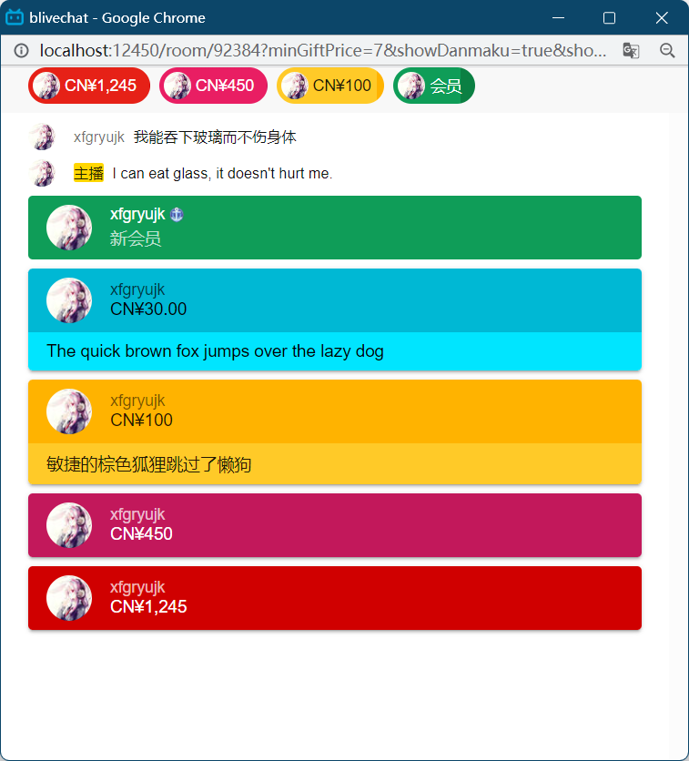

# blivechat

用于OBS的仿YouTube风格的bilibili直播评论栏





## 特性

* 兼容YouTube直播评论栏的样式
* 付费礼物模仿醒目留言显示
* 高亮舰队、房管、主播的用户名
* 支持屏蔽弹幕、合并相似弹幕等设置
* 自带两种样式生成器，经典YouTube风格和仿微信风格
* 支持前端直连B站服务器或者通过后端转发
* 支持自动翻译弹幕、醒目留言到日语，可以在后台配置翻译目标语言
* 支持标注打赏用户名的读音，可选拼音或日文假名
* 支持配置自定义表情，不需要开通B站官方表情

## 使用方法

以下几种方式任选一种即可

### 一、本地使用

1. 下载[发布版](https://github.com/xfgryujk/blivechat/releases)（仅提供x64 Windows版）
2. 双击`blivechat.exe`运行服务器，或者用命令行可以指定host和端口号：

    ```sh
    blivechat.exe --host 127.0.0.1 --port 12450
    ```

   或者也可以在配置文件里指定host和端口号

3. 用浏览器打开[http://localhost:12450](http://localhost:12450)，输入主播在开始直播时获得的身份码，复制房间URL
4. 用样式生成器生成样式，复制CSS
5. 在OBS中添加浏览器源，输入URL和自定义CSS

**注意事项：**

* 本地使用时不要关闭blivechat.exe那个黑框，否则不能继续获取弹幕
* 样式生成器没有列出所有本地字体，但是可以手动输入本地字体
* 如果需要使用翻译功能，建议看[配置官方翻译接口傻瓜式教程](https://www.bilibili.com/read/cv14663633)

### 二、公共服务器

请优先在本地使用，使用公共服务器会有更大的延迟，而且服务器故障时可能发生直播事故

* [公共服务器](http://chat.bilisc.com/)

### 三、源代码版（自建服务器或在Windows以外平台）

0. 由于使用了git子模块，clone时需要加上`--recursive`参数：

    ```sh
    git clone --recursive https://github.com/xfgryujk/blivechat.git
    ```

    如果已经clone，拉子模块的方法：

    ```sh
    git submodule update --init --recursive
    ```

1. 编译前端（需要安装Node.js）：

    ```sh
    cd frontend
    npm i
    npm run build
    ```

2. 运行服务器（需要Python3.8以上版本）：

    ```sh
    pip3 install -r requirements.txt
    python3 main.py
    ```

    或者可以指定host和端口号：

    ```sh
    python3 main.py --host 127.0.0.1 --port 12450
    ```

3. 用浏览器打开[http://localhost:12450](http://localhost:12450)，以下略

### 四、Docker（自建服务器）

1.  ```sh
    docker run --name blivechat -d -p 12450:12450 \
      --mount source=blivechat-data,target=/mnt/data \
      xfgryujk/blivechat:latest
    ```

2. 用浏览器打开[http://localhost:12450](http://localhost:12450)，以下略

## 自建服务器相关补充

### 服务器配置

服务器配置在`data/config.ini`，可以配置数据库和允许自动翻译等，编辑后要重启生效

**自建服务器时强烈建议不使用加载器**，否则可能因为混合HTTP和HTTPS等原因加载不出来

### 参考nginx配置

`sudo vim /etc/nginx/sites-enabled/blivechat.conf`

```nginx
upstream blivechat {
	keepalive 8;
	# blivechat地址
	server 127.0.0.1:12450;
}

# 强制HTTPS
server {
	listen 80;
	listen [::]:80;
	server_name YOUR.DOMAIN.NAME;

	return 301 https://$server_name$request_uri;
}

server {
	listen 443 ssl;
	listen [::]:443 ssl;
	server_name YOUR.DOMAIN.NAME;

	# SSL
	ssl_certificate /PATH/TO/CERT.crt;
	ssl_certificate_key /PATH/TO/CERT_KEY.key;

	set $blivechat_path /PATH/TO/BLIVECHAT;

	client_body_buffer_size 256k;
	client_max_body_size 1.1m;

	# 代理header
	proxy_http_version 1.1;
	proxy_set_header Host $host;
	proxy_set_header Connection "";
	proxy_set_header X-Real-IP $remote_addr;
	proxy_set_header X-Forwarded-For $proxy_add_x_forwarded_for;

	# 静态文件
	location / {
		root $blivechat_path/frontend/dist;
		try_files $uri $uri/ @index;
	}
	# 不存在的文件请求转发到index.html，交给前端路由
	location @index {
		rewrite ^ /index.html last;
	}
	location = /index.html {
		root $blivechat_path/frontend/dist;
		# index.html不缓存，防止更新后前端还是旧版
		add_header Cache-Control no-cache;
	}
	location /emoticons {
		alias $blivechat_path/data/emoticons;
	}
	# 动态API
	location /api {
		proxy_pass http://blivechat;
	}
	# websocket
	location = /api/chat {
		proxy_pass http://blivechat;

		# 代理websocket必须设置
		proxy_set_header Upgrade $http_upgrade;
		proxy_set_header Connection "Upgrade";

		# 由于这个块有proxy_set_header，这些不会自动继承
		proxy_set_header Host $host;
		proxy_set_header X-Real-IP $remote_addr;
		proxy_set_header X-Forwarded-For $proxy_add_x_forwarded_for;
	}
}
```
